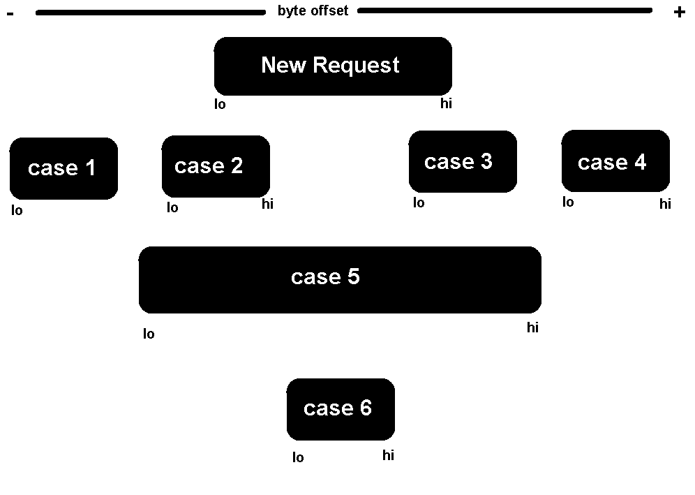
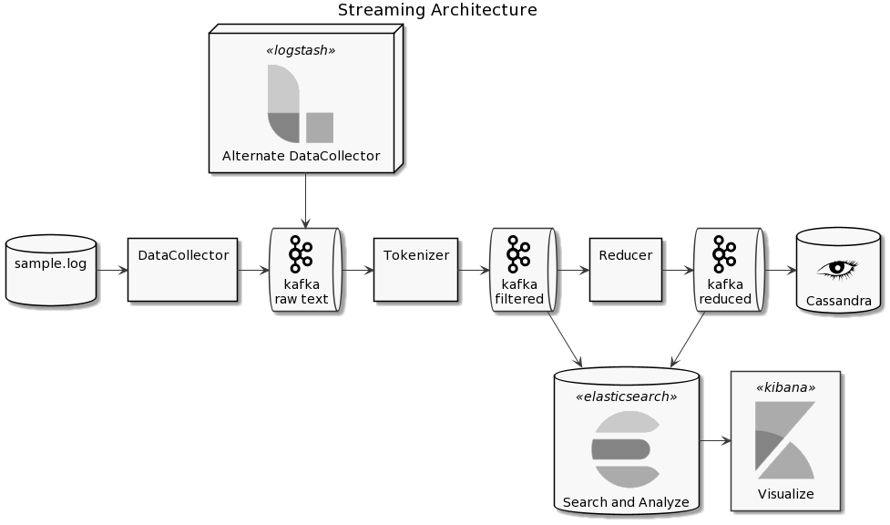

# Log Processing Delivery
## Assumptions
The assumption was made that the file size for each request was either an extra lookup away 
or was open-ended (continuous streaming).
In either case if the start or the middle of the data is missing the file is not complete.
But if we have the extra information about the total size then 
we can tell apart the seemingly complete files (i.e. 0 to max data delivered) 
from the absolutely complete files. 

## The algorithm
 
Most likely a brute force approach, but an easy to understand, to debug and test against. 
It relies on the fact that the data packet requests arrive in sequence and can overlap in a finite different configurations.
Allowing for summarizing into a few or ideally single data point.

It assumes the system is in a steady state so the new request is likely the first request and the algorithm builds on that.
If it is not (packet out of order, lost or system) it makes most of what information is received and will still be valid and functional.

The system maintains a list of lo-hi tuples indexed by the key (IpAddress, UserAgent, Request).
It is empty by default and accumulates dissociated lo-hi tuples. If any two tuples overlap, they are merged into a single wider one.
Ultimately this leads to a single [0 - LastByteServed] tuple indicating no lost and easy to query for completeness of delivery.

This figure shows the different overlapping cases.

The construction of the list follows these steps upon reception of a new request:

* If list is empty add new request lo-hi tuple to the list
* If list is not empty recursively take one tuple from the list
    * If case 1 or 4, (completely separate) go to next & keep looping (another one in the list might overlap)
    * If case 2, 3, 5, 6, update tuple from the list to the largest possible lo-hi range, break the loop
    * If a merge had happened the list might contain more overlapping tuples, recurse thru these same steps
    * If the new request remained separate, add to the list 

Cases 1-6 are packets already in the system, New Request is the candidate for a merge or addition to the list
1. In this case both the lo and hi bytes are less than the new lo, no update/merge
2. In this case list packet lo remains but it's hi is updated with the new request's hi
3. Mirror of case 2, hi remains and lo is updated
4. Separate, no update
5. In this case the New Request is completely contained so bring no new information, no update
6. In this case, opposite of case 5, both lo and hi get update

Care needs to be taken with the border cases and so contiguous is considered overlapping and accounted for in the calculations.

Other special cases, that require filtering, i.e. not processing a new request are explicitly handle in the conversion from text log to internal object for data processing.
(Status code, invalid byte ranges ,etc.) 

Example:

Source data

Key | Satus | ByteRange
------------ | ------------- | ------------- 
1 | Valid | 0-289
1 | Valid | 289-578
1 | Valid | 578-867
1 | Valid | 867-1156

Key | Satus | ByteRange
------------ | ------------- | ------------- 
2 | InValid | 0-359
2 | InValid | 359-718
2 | Valid | 718-1077
2 | Valid | 1077-1436
2 | Valid | 1436-1795

Summarized data

Key | Satus | ByteRange | Complete?
------------ | ------------- | ------------- | -------------
1 | Valid | 0-1156 | Yes (as far as we know)
2 | InValid | 718-1795 | No (as far as we know)

In that format the query to know if the data was delivered or not is a matter of either doing the range arithmetic 
or applying the algorithm as a boolean question rather than a merge request on a lo-hi range.

## The code

### Standalone
A quick standalone prototype of that algorithm was created to run reading the sample log file in it's entirety and then processing line by line.
It was made in a test rig design pattern but never moved to an actual "unit testing framework".
Four test were created in an effort to cross validate results and robustness of the algorithm.
Output was some simple "statistics"/information about the results, i.e. 
1. number of complete delivery (0 to max) 
2. number of incomplete due to a 0 to x range (start missing)
3. number of incomplete due to a x1 to x2 range (middle missing)

* Test 1 is a file sequential playback of the data
* Test 2 is a reverse order playback of the data
* Test 3 is a random order complete playback of the data
* Test 4 is a random order potentially incomplete & with duplicate playback of the data

At a later stage a database persistence prototype was added
and so was an Excel csv (actually tab delimited) formatted file.

 
 ### Streaming
The idea behind the sequential playback of the data in the standalone mode was to allow for code reuse in a streaming environment.
So an "infrastructure-in-a-docker" was built to allow for a quick turnarounds. 
The python code acting as data collector & Logstash not cooperating, 
the infrastructure starts with Kafka as data broker, and main component 
as even if Elasticsearch and Kibana are also live the data is currently not streaming to them.
A Cassandra database is part of it also and is fed in an exploratory manner.

The code of the streaming application is a python package named [Faust](https://faust.readthedocs.io/en/latest/)/[on github](https://github.com/robinhood/faust) that meshes with Kafka 
to allow light workers to be defined and linked thru streaming topics.
There's a worker on a timer that feeds the data read from file, one line at a time every 10ms.
Next is a tokenizer that dice the raw text into it's data fields create an object for the algorithm to process.
It feeds that object to the next two parallel workers, 
one that apply the summarizing algorithm to generate the data as seen in the result table about which is then passed to a Cassandra writer that persist the result in database for manual query.
The other parallel worker (would) persist the object (all the raw fields) to Elasticsearch for more detailed and controlled analytics.

There was consideration for feeding both persistence layer with raw vs summarized data out of curiosity. 
(Maybe in UAT, but not in POC for now...)

The diagram below shows the planned architecture of what the docker supports (minus logstash the needs to be figured out)

 
 
 
  ## Hands-on
 To run the code, 
 on a Windows machine, the standalone part was tested with Visual Studio 2019 with Python Extension.
 But the simplest is to start with a linux and 
 install Anaconda/Miniconda, 
 create a python 3.8 virtual environ
 get the packages required via the requirements file
 'make kafka-elk' to start docker compose and the infrastructure required
 then 'make run-standalone-app' to run the 4 different tests, 
 they automatically generate an excel file for simple query of the results and should be resistant to most failures.
 
 All/most commands can be found in chronological order in the init.sh (as reference, not to be executed per se).
 
 
 ## Discussion
  I have focused more on the development environment, reproducibility and the proof-of-concept side of things, 
 versus simply dumping the processed data in a high level elasticsearch cluster.
 
 So the user experience (in Excel? or SQL) might not be the ideal.
 I think it is my bias toward insuring quality of the data on the producer side 
 rather than the user experience on the consumer side.
 I would think that the first half, the lower levels, of the pipeline, are well defined 
 and now that there is a data set to play with at higher level, the second half, metrics, queries, dashboards could be worked on in more details.

Based on the different overlap cases a set of "unit" test cases could be factored and then created at scale with the expected results
those would be part of the testing infrastructure in the CI/CD along with more integral regression test that covers the whole pipeline.
Adding another pass with random data and making sure there's a code coverage process that can be analyzed to evaluate the scale of testing and remediate any lack. 

So thinking about a Production environment, I would probably opt for a non-interpreted language like Java
or a high level framework which the architecture covers with logstash.
All components of that architecture are cluster native and would horizontally scale with the need and fit right in a production environment.
So that single docker compose, multi image is a good start.

Depending on the actual requirements from the users, this type of dynamic data is probably not valuable for very long after that data has been streamed
unless there's a need for some record keeping at long. 
So data would likely be on a quick archive delete schedule given that the source data is probably archived longer and can be used to recover the derived one.
This is just a first thought but it really depdends on the context of usage, regulation, etc. Elasticsearch not being a real persistence layer favor that argument also.

Table of options for each phase of the data pipeline

Data Collectors | Message Bus | Processor | Persistence | Presentation
------------ | ------------- | ------------- | ------------- | -------------
Logstash | Kafka | Storm | Cassandra | Kibana
Fluentd | RabbitMQ | Spark | ElasticSearch |
Flume | ZeroMQ | Flink | |
NiFi | | Beam | |
 -   | -  | Faust(Python) | |   

 
