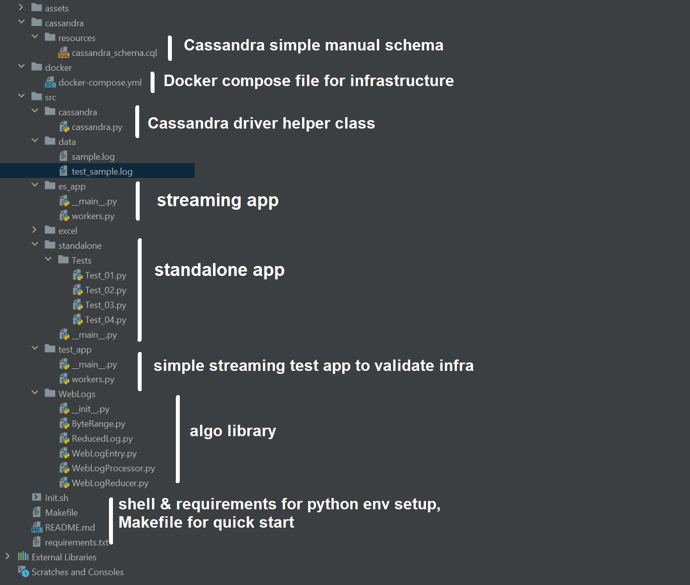
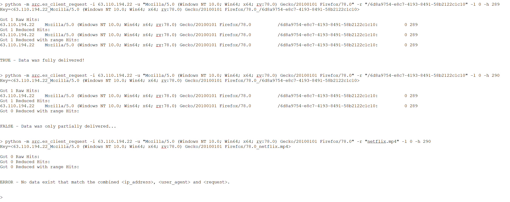

# Log Processing Delivery
## Assumptions
The assumption was made that the file size for each request was either an extra lookup away or was open-ended (continuous streaming).
In either case if the start or the middle of the data is missing the file is not complete.
But if we have the extra information about the total size then we can tell apart the seemingly complete files (i.e. 0 to max data delivered) from the absolutely complete files.
Also given a client application being queried, by using the file size as upper limit the requirement is covered. 

## The algorithm
 
Most likely a brute force approach, but an easy to understand, to debug and test against. 
It relies on the fact that the data packet requests arrive in sequence and can overlap in finite different configurations.
Allowing for summarizing into a few or ideally single entry per key (IpAddress, UserAgent, Request).

It assumes the system is in a steady state so a new request is likely the first request and the algorithm builds on that.
If it is not, it makes the most out of the information received and will still be valid and functional.

The system maintains a list of lo-hi tuples indexed by the key (IpAddress, UserAgent, Request).
It is empty by default and accumulates dissociated (non-overlapping) lo-hi tuples. If any two tuples overlap, they are merged into a single wider one.
Ultimately this leads to a single [0 - LastByteServed] tuple indicating no lost and easy to query for completeness of delivery.

This figure shows the different overlapping cases.

The construction of the list follows these steps upon reception of a new request:

* If list is empty add new request lo-hi tuple to the list
* If list is not empty recursively take one tuple from the list
    * If case 1 or 4, (completely separate) go to next & keep looping (another one in the list might overlap)
    * If case 2, 3, 5, 6, update tuple from the list to the largest possible lo-hi range, break the loop
    * If a merge had happened the list might now contain more overlapping tuples, recurse thru these same steps
    * If the new request remained separate, add to the list 

Cases 1-6 are packets already in the system, New Request is the candidate for a merge or addition to the list
1. In this case both the lo and hi bytes are less than the new lo, no update/merge
2. In this case list packet lo remains but it's hi is updated with the new request's hi
3. Mirror of case 2, hi remains and lo is updated
4. Separate, no update
5. In this case the New Request is completely contained so brings no new information, no update
6. In this case, opposite of case 5, both lo and hi get updated

Care needs to be taken with the border cases and so contiguous is considered overlapping and accounted for in the calculations.

Other special cases, that require filtering, i.e. not processing a new request are explicitly handle in the conversion from text log to internal object for data processing.
(Status code, invalid byte ranges ,etc.) 

Example:

Source data

Key | Satus | ByteRange
------------ | ------------- | ------------- 
1 | Valid | 0-289
1 | Valid | 289-578
1 | Valid | 578-867
1 | Valid | 867-1156

Key | Satus | ByteRange
------------ | ------------- | ------------- 
2 | InValid | 0-359
2 | InValid | 359-718
2 | Valid | 718-1077
2 | Valid | 1077-1436
2 | Valid | 1436-1795

Summarized data

Key | Satus | ByteRange | Complete?
------------ | ------------- | ------------- | -------------
1 | Valid | 0-1156 | Yes (as far as we know)
2 | InValid | 718-1795 | No (as far as we know)

In that format the query to know if the data was delivered or not is a matter of either doing the range arithmetic 
or applying the algorithm as a boolean question rather than a merge request on a lo-hi range.

## The code

### Standalone
A quick standalone prototype of that algorithm was created to run reading the sample log file in it's entirety and then processing line by line.
It was made in a test rig design pattern but never moved to an actual "unit testing framework".
Four test were created in an effort to cross validate results and robustness of the algorithm.
Output was some simple "statistics"/information about the results, i.e. 
1. number of complete delivery (0 to max) 
2. number of incomplete due to a 0 to x range (start missing)
3. number of incomplete due to a x1 to x2 range (middle missing)

* Test 1 is a file sequential playback of the data
* Test 2 is a reverse order playback of the data
* Test 3 is a random order complete playback of the data
* Test 4 is a random order potentially incomplete & with duplicate playback of the data

At a later stage a database (Cassandra) persistence prototype was added
and so was an Excel csv (actually tab delimited) formatted file.

 
### Streaming
The idea behind the sequential playback of the data in the standalone mode was to allow for code reuse in a streaming environment.
So an "infrastructure-in-a-docker" was assembled to allow for quick turnarounds. 
The python code acting as data collector (and Logstash not cooperating), 
the infrastructure starts with Kafka as data broker, 
Elasticsearch and Cassandra act as persistence layer
and Kibana as potential presentation layer (nothing was done with Kibana except confirming data was visible from Elasticsearch).
Cassandra database was part of the build to investigate the Collections columns in an attempt to absolutely summarize the data to a single entry per key, but investigation was not completed even if potential is there.

The code of the streaming application is a python package named [Faust](https://faust.readthedocs.io/en/latest/)/[on github](https://github.com/robinhood/faust) that meshes with Kafka to allow light workers to be defined and linked thru streaming topics.
There's one worker on a timer that feeds the data read from file, one line at a time every 10ms.
Next is a tokenizer that dices the raw text into it's data fields and creates an object for the algorithm to process.
Then it feeds that object to the next two parallel workers, 
one that feeds the Elasticsearch 'raw_weblogs' index
and one that applies the summarizing algorithm.
That last worker sends the summarized/reduced data to yet two more workers. 
One worker feeds the Elasticsearch 'reduced_weblogs' index.
The other worker feeds the Cassandra table (but was disable due to time).

The considerations for feeding both raw and reduced data set to the persistence layer was mostly for feedback on the process. 
A production version would probably consider only the final result as sufficient de pending on the use cases.

The diagram below shows the planned architecture of what the docker supports (minus logstash the needs to be figured out)

 
 
 
## Hands-on
To run the code, 
on a Windows machine, both the standalone part and the client par were tested with Visual Studio 2019 with Python Extension.
But for more in-depth dive, the simplest is to start with a Linux OS, 
install Anaconda/Miniconda, 
create a python 3.8 virtual environ
get the packages required via the requirements file
'make kafka-elk' to start docker compose and the infrastructure required
'make run-standalone-app' to run the 4 different tests,
(they automatically generate an excel file for simple query of the results and should be resistant to most failures)
'make manual-map-raw-es' to add an Elasticsearch mapping for the raw data,
'make manual-map-reduced-es' to add an Elasticsearch mapping for the reduced data,
'make run-es-app' to stream the data to Elasticsearch,
then access Kibana on http port 5601 to drill thru the data  
 
or run the client to query Elasticsearch directly:
> python -m src.es_client_request -i <ip_address> -u "<user_agent>" -r "<request>" -l <lo_byte> -h <hi_byte>

 

All/most commands can be found in chronological order in the init.sh (as reference, not to be executed per se).
 
 
## Discussion
### Coverage
I made the decision to focused on the development environment, reproducibility and the streaming proof-of-concept side of things, 
versus simply dumping the batched processed (or raw!) data in an Elasticsearch cluster and take the high level/ user approach.
So the user experience and analytics, dashboard etc. is not as evolved as it can be.
But I think having the data delivered and ready to be open-ended-ly investigated is and advantage in preliminary steps. 

### Testing
For more thorough testing and with the optic of having an actively modified and worked-on system, the following would be advisable.
Build based on the different cases of overlap, a set of unique "unit" test cases. 
Then a different set, based on the simple unique ones, created at scale thru a random process. 
Those would be part of the testing infrastructure in the CI/CD along with more integral regression test that covers the whole pipeline.
Adding another pass with random data and making sure there's a code coverage process that can be analyzed to evaluate the scale of testing and remediate any lacking area.
There's some literature and research that supports a simple ~1,000,000 iteration loop over random choices of which method/function/code is being executed
in order to try to execute all possible code path in unexpected order and therefore remove the developer testing bias.

### Production
In terms of production environment, 
depending on the testing capabilities and ease of proving code coverage with those tests,
I would probably opt for a non-interpreted language like Java or a high level framework which the architecture covers with logstash.
High level frameworks are more mature than any code can become starting now and are usually flexible enough to cover current and future needs at the time of the assessment.
All components of that architecture are cluster native and would horizontally scale with the need and fit right in a production environment.
Faust supports partitioning (so is the infrastructure) and so multiple of a defined single worker could be spun up to process in parallel a different subset of the data traffic.
In this case the key being the combination of ip_address, user_agent and request. 
So that single docker compose with multi image is a good base.

### Data life cycle
Depending on the actual requirements from the users, this type of dynamic data is probably not valuable for very long after that data has been requested and delivered 
unless there's a need for some record keeping at long. 
So data would likely be on a quick archive delete schedule given that the source data is probably archived longer and can be used to recover the derived one.
Ultimately it really depends on the context of usage, regulation, etc. 
But Elasticsearch not being a real persistence layer favor that argument also.

Here's a table of some possible options for each step of the data pipeline

Data Collectors | Message Bus | Processor | Persistence | Presentation
------------ | ------------- | ------------- | ------------- | -------------
Logstash | Kafka | Storm | Cassandra | Kibana
Fluentd | RabbitMQ | Spark | ElasticSearch |
Flume | ZeroMQ | Flink | |
NiFi | | Beam | |
Python | | Faust | |   

